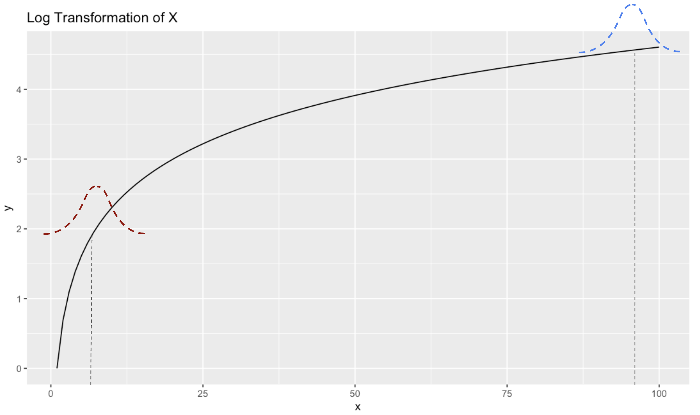
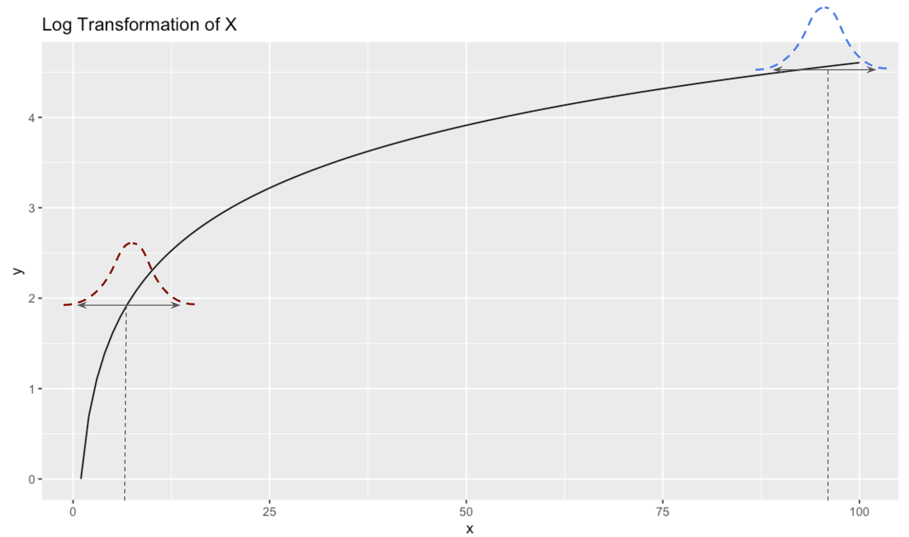
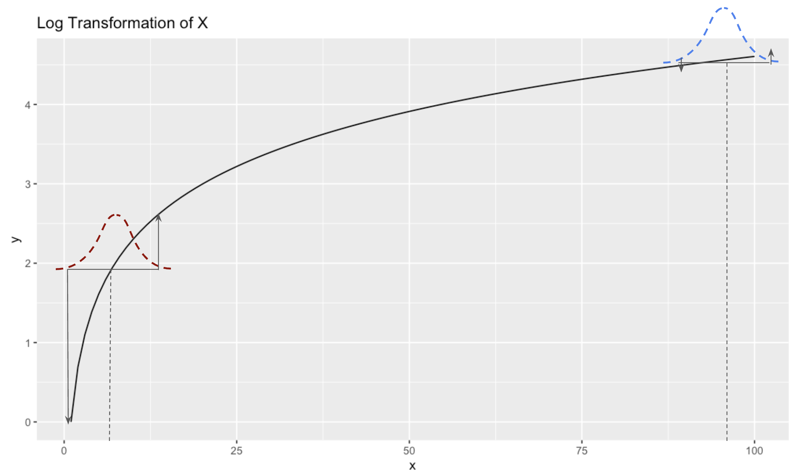

```{r setup, warning=FALSE, message=FALSE, echo=FALSE}
set.seed(44)
library(tidyverse)
library(scales)
```

If you are a Data Scientist, Economist, or have worked on analyzing A/B experiments, you've likely used something in Statistics called the **Delta Method**. I have used it extensively throughout my career, generally to estimate the variance of certain metrics in the context of experiments. However, I never really understood what it was. I found most explanations of it to be confusing, since they use unintuitive language like "the variance of a function of a random variable" (what is a function of a random variable? and what is the variance of a function?) and bring in derivatives from techniques like Taylor Expansion.

I never could work through how a derivative of a function had anything to do with something like variance, which I associate as a formula to apply to a set of numbers. Where do functions and derivatives come into play?

After many years of not really understanding the Delta Method, and being dissatisfied with explanations online, I decided to sit down and figure it out in a way that I could explain to others like me (so folks with some statistical background).

In this post, we'll walk through an intuitive explanation of the Delta Method. Then, once we develop the intuition, we'll derive it mathematically. Finally, we'll see a more complex example that might be more akin to something we'd encounter in the wild.

# Delta Method Intuition

The [Delta Method](https://en.wikipedia.org/wiki/Delta_method) is a way of estimating the variance of a *function of a random variable**.*** Generally the function is non-linear, since if it's linear then you can just take the variance using the regular way.

So let's consider some non-linear function that we might apply to a random variable. The simplest one that comes to mind is a log transformation, since that is often used in statistics to compress larger values and stretch smaller ones.

## Log Transformation of a Random Variable

To start, let's get a refresher of what a log transformation looks like. We'll take the range `[1,100]` and plot the log of those values on the Y-axis:

```{r}
plt <- tibble(
  x = 1:100,
  y = log(x)
) |> 
  ggplot(aes(x,y)) + 
  geom_line() + 
  ggtitle('Log Transformation of X')
plt
```

The relationship is **non-linear**. When values of X are very small, say between 1 and 10, the values of Y range relatively large, between 0 and 2.3. But as X values get large, say between 90 and 100, the values of Y are much more narrow, between 4.5 and 4.6.

### The Variance of a function?

Now imagine we wanted to know the variance of $Log(x)$. First off, what do we mean by the variance of $Log(x)$? For me this was always confusing when reading textbooks that talked about the Delta Method - *what does it mean to take the variance of a function?* We're used to taking the variance of data, which makes sense, but the variance of a function, where there are no data points to use, is not at all intuitive. At least to me it isn't.

But let's think about in in the context of sample means. Think of $X$ as a random variable with a mean $\mu_{x}$ of 5. Let's say we get some data from X, compute a sample mean $\bar{X}$, and the value happens to be 5:

```{r}
plt + 
  annotate("point", x = 5, y = log(5), color = 'red', size = 2.5)
```

Now let's imagine we draw another random sample. It's unlikely to be **exactly** 5 again, but will probably come out to something in the ballpark of 5. And if we drew thousands of random samples, we'd expect the *distribution* of our sample means to be approximately normal peaking at the mean value 5.

Now let's imagine that instead of 5, the mean of our random variable is 95. Again, by drawing thousands of samples of this random variable, we get a normal distribution of outcomes peaking around 95. These distributions would look something like this:



And their variances would simply be $\frac{\sigma^2}{n}$ . And their variances would also be equal.

But, now let's consider what the variances of their Log transformation would be. To visualize that, let's draw a line between the bulk of the distribution to show the spread:



And now let's see the range of values these take on at in terms of Y:



What do we notice? The range of possible $Y$ values that the red distribution takes on is much larger than the range of $Y$ values that the blue distribution takes on.

In other words, even though the variances of $X$ are the same when the means are 5 and 95, the variance of $Log(X)$ is much larger when the mean is 5 than when it's 95, due to the non-linearity of the log transformation. Specifically the way it stretches lower values and compresses higher values.

Another way of putting this is that the variance of $Log(X)$ depends on the **slope** of $Log(X)$ around the value that x takes on. The slope when $\mu_{x} = 5$ is higher than the slope when $\mu_{x} = 95$, which is why the variance is higher at 5 than it is at 95. And remember that when we talk about slope, we are talking about the **derivative of the function.** Basically, the variance is scaled by some factor related to the slope of the function.

**This is the key intuition behind the Delta Method**, which says that if $X$ is a random variable with:

-   Mean $E[X] = \mu$

-   Variance $Var(X) = \sigma^2$

And $g(X)$ is a differentiable function of $X$ (like $Log(X)$) , the Delta Method approximates the variance of $g(X)$ as:

$$
Var(g(X)) \approx (g\prime(\mu))^2\cdot Var(X)
$$

Of course $g\prime(\mu)$ is the slope of the function at the mean value. The reason why it's scaled by the square of that, is because variance deals with squared values.

So in our example, if $g(X)=Log(X)$, then $g\prime(x) = \frac{1}{x}$ and $Var(Log(x)) \approx \frac{1}{x}^2 \cdot Var(x)$

Let's try it out in a coded example:

### Example: Variance of $Log(X)$ when $\mu = 5$ vs $\mu = 95$

Let's take a random sample from the population where the mean is 5:

```{r}
sd = 5
sample_mean_5 = rnorm(1000, mean = 5, sd = sd)
```

From these sample values, we can compute the variance (here we're dealing with the variance of the sampling distribution, so we divide by n):

```{r}
var(sample_mean_5)/1000
```

But taking the variance of the log transformed values won't return the correct variance.

```{r}
var(log(sample_mean_5))/1000
```

Applying the delta method gives us the correct variance:

```{r}
(1/5)^2*var(sample_mean_5)/1000
```

Let's check that this value is larger than the variance when the mean is 95:

```{r}
sample_mean_95 = rnorm(1000, mean = 95, sd = sd)
```

```{r}
(1/95)^2*var(sample_mean_95)/1000
```

It is - but of course just finding that the variance at 95 is smaller than the variance at 5 isn't completely satisfying me that I went about this correctly.

In these cases where I want to check my work, I find that using simulation is a good way to go. So let's use bootstrap simulation to check our work:

### Bootstrap Simulation to check our work

So the variance at 5 is larger than 95, which is what we expect. Now let's try bootstrapping to check our work.

The way this works is very simple. We'll take our sampled values and resample from them, generating 10,000 different sample means. Then we'll take the variance and see if they come close to the estimates we computed above. We'll start with $\mu_{x}=5$

```{r}
resample <- function(means) {
  new_sample = sample(means, replace = T)
  log(mean(new_sample))
}

bootstrap_mean_5 <- replicate(10000, resample(sample_mean_5))
var(bootstrap_mean_5)
```

Which is very close to the `0.0009287053` we got above. Now let's try it for $\mu_{x}=95$:

```{r}
bootstrap_mean_95 <- replicate(10000, resample(sample_mean_95))
var(bootstrap_mean_95)
```

Again, this is very close to the value we got above of `2.704471e-06`

# Derivation of the Delta Method

In the above section we covered the intuition behind the Delta Method. Now that we understand it intuitively, let's derive it.

We'll start with the regular formula for variance:

$$
Var(X) = \mathbb{E}[(X-\mathbb{E}[X])^2]
$$

Then the variance of a transformation $g(X)$ would be:

$$
Var(g(X)) = \mathbb{E}[(g(X)-\mathbb{E}[g(X)])^2]
$$

We can approximate $g(X)$ using a first order Taylor Expansion:

$$
g(X) \approx g(\mu_{x}) + g\prime(\mu_x)(X-\mu_x)
$$

This is where the concept of using the slope of the function, which we used above to build our intuition, comes into play. For a good review on Taylor Expansions, I recommend [this 3Blue1Brown video](https://www.youtube.com/watch?v=3d6DsjIBzJ4&themeRefresh=1).

If we take expectations on both sides of the Taylor Expansion relationship, we get the following:

$$
\mathbb{E}[g(X)] \approx g(\mu_x) + g\prime(\mu_x)\cdot\mathbb{E}[X-\mu_x]
$$

(Note that because $g(\mu_x)$ and its derivative are constants, the expectation operator does not apply. Furthermore, $\mathbb{E}[X-\mu_x]=0$ so the whole things becomes $E[g(X)]=g(\mu_x)$ .

We can plug that relationship back into the Taylor Expansion equation and get:

$$
g(X) -\mathbb{E}[g(X)] \approx  g\prime(\mu_x)(X-\mu_x)
$$

By rearranging this, the values on the left hand side of the equation are the same as what $Var(g(X))$ is equal to above. So we can substitute the right hand side of the equation back into our variance equation and get:

$$
Var(g(X)) \approx \mathbb{E}[(g\prime(\mu_x)(x-\mu_x))^2]
$$

We can pull out the $g\prime(\mu_x)^2$ because it's just a constant, giving us:

$$
Var(g(X)) \approx g\prime(\mu_x)^2\mathbb{E}[(X-\mu_x)^2]
$$

And now notice that $\mathbb{E}[(X-\mu_x)^2]$ is the same as $Var(X)$, so

$$
Var(g(x)) = g\prime(\mu_x)^2\cdot Var(X)
$$

Which is the formula we used above.

# A more complicated, but practical example

One of the most common use cases for the Delta Method is in the context of an A/B experiment. In an A/B experiment, you compare how metrics behave between a control and treatment group. Generally you care about computing the mean of the metrics, and then computing their variances to get a standard error which will ultimately get you a p-value.

Most metrics don't require you to use the Delta Method. I work at Airbnb, so I'm going to use that as a test case. A common metric we might want to move up is the number of Bookings made. This does not require the Delta Method, since it's a simple metric and not a transformation of one (or multiple).

An example of where we'd use the delta method would be something like Price for Available Night, or any other metric derived as the *ratio of two metrics***.**

Let's see how this would work.

## Data

We'll just simulate data from 1,000 Airbnb-style listings. In one column we'll have the number of nights the listing has available on their calendar, and in another column we'll have the total price for all those nights.

Let's assume something we did in our experiment and we want to know if it caused the treatment group to raise their prices. In the simulation we'll raise them ever so slightly, but not enough to be considered statistically significant.

```{r}
set.seed(94611)
subjects = 1000
control_price = 150
treatment_effect = 0.012
control_df <- tibble(
  nights = sample(1:365, size = subjects, replace = T),
  price = rnorm(n = subjects, mean = control_price, sd = 22)*nights,
) 

treat_df <- tibble(
  nights = sample(1:365, size = subjects, replace = T),
  price = rnorm(n = subjects, mean = control_price*(1+treatment_effect), sd = 22)*nights,
) 

```

We can check to see if the average price per night changed by simply computing the sample means and comparing them:

```{r}
control_mean <- sum(control_df$price)/sum(control_df$nights)
treatment_mean <- sum(treat_df$price)/sum(treat_df$nights)
lift = (treatment_mean-control_mean)/control_mean
cat("Control Mean: ", control_mean)
cat("\nTreatment Mean: ", treatment_mean)
cat("\nPrice difference: ", percent(lift, accuracy = .1))
```

However, in A/B testing we want to also understand whether the lift is statistically significant. For that we need to perform some sort of statistical test where we get a p-value. This involves computing the variance of the sampling distribution our metric, `Price/Nights`.

If we had a simpe metric like bookings, we could just compute the variance of the sampling distribution the normal way:

$$
\frac{\sigma^2}{n}
$$

Or in code:

```{r}
var(control_df$price/control_df$nights)/subjects
```

But this is incorrect. Let's carry out our hypothesis testing using this incorrect variance estimate and see what we get:

```{r}
bad_var_control <- var(control_df$price/control_df$nights)/subjects
bad_var_treatment <- var(treat_df$price/treat_df$nights)/subjects
stderr = (bad_var_treatment + bad_var_control)^0.5
z_stat = (treatment_mean - control_mean)/stderr
pvalue = 2 * (1 - pnorm(abs(z_stat)))
cat("\nP-value: ", pvalue)
```

This is right below the sacred p-value threshold of 5%, so normally we'd reject the null hypothesis and say that this 1.3% lift is statistically significant and probably ship the treatment.

However, computing the variance of `Price/Night` this way is incorrect. Why? Consider how each listing is treated. Computing it this way, they are all treated equally. A listing with 1 night priced at \$500 would have an average `Price/Night` of \$500. Meanwhile, a listing with 365 nights priced at \$100 would have an average `Price/Night` of \$100. But the second listing with 365 nights has much more impact on the average price per night. 365 times as much. So treating them with equal weight is incorrect and is akin to taking the average of an average. But that's exactly what:

```{r}
var(control_df$price/control_df$nights)/subjects
```

is doing, which is why doing that is incorrect.

## Applying the Delta Method

So how do we compute the variance of our sampling distribution if the standard formula is no good for ratio metrics. The answer is to use the **Delta Method**. Since we're not talking about $g(X) = Log(X)$, but rather $g(X,Y) = X/Y$, we want to use this formula instead (we'll derive this in the next section).

$$
Var(\frac{X}{Y}) = \mu_{y}^{-2} \cdot (Var(X) + Var(Y)\cdot(\frac{\mu_x}{\mu_y})^2) -2Cov(X,Y)\cdot(\frac{\mu_x}{\mu_y})
$$

This is much more complex than the formula for $Var(Log(X))$, but don't worry we'll break it down later.

For now let's put this into code:

```{r}
var_delta_method <- function(df) {
  n = nrow(df)
  numerator_mean = mean(df$price)
  denominator_mean = mean(df$nights)
  numerator_var = var(df$price)/n
  denominator_var = var(df$nights)/n
  covariance = cov(df$price, df$nights)/n
  
  ratio = numerator_mean / denominator_mean
    
  denominator_mean^-2 * (numerator_var + (denominator_var * ratio^2) - 2*covariance * ratio)
  
}
```

Now we can compute the variance of our ratio metric using the Delta Method:

```{r}
control_var = var_delta_method(control_df)
treatment_var = var_delta_method(treat_df)
```

And perform the same statistical test we did above:

```{r}
stderr = (treatment_var + control_var)^0.5
z_stat = (treatment_mean - control_mean)/stderr
pvalue = 2 * (1 - pnorm(abs(z_stat)))
cat("\nPrice difference: ", percent(lift, accuracy = .1))
cat("\nP-value: ", pvalue)
```

This time we get the correct p-value, 0.078. In this case, we would fail to reject the null hypothesis, which would be the correct thing to do (and not ship the treatment experience).

# Checking results by bootstrapping

Again, let's use bootstrap simulation to convince ourselves that we did the right thing. After all, the formula for $Var(\frac{X}{Y})$ was quite complex looking and we have yet to derive it. It might feel like we took a leap of faith, so by boostrap simulation we can triangulate our results.

```{r}
cat("Bad Variance Estimate: ", bad_var_control)
cat("\nDelta Method Variance Estimate: ", control_var)
```

The idea behind it is very simple. Recall that the interpretation of our variance metric is something like this:

We have a sample mean from our data. If we ran our experiment again, it would be very unlikely that our sample mean would be **exactly** the same as this one. But it should be close. The variance tells us how much we'd expect a large number of sample means to spread out.

Bootstrapping follows the same logic. Of course it's not really feasible to run our experiment thousands of times, but we can randomly sample data from the sample we have to pretend that we're running thousands of experiments and getting thousands of sample means. Then computing the variance of those simulated sample means should give us a good estimate of the variance. Let's see it in action:

```{r}
metric_sample <- function(df) {
  resampled_df <- df[sample(nrow(df), replace = TRUE), ]
  
  sum(resampled_df$price) / sum(resampled_df$nights)
}

bootstraps <- replicate(10000, metric_sample(control_df))

var(bootstraps)
```

The variance of our bootstrapped sample means comes out to 0.52, which is about the same as the estimate we got with the Delta Method formula!

By the way, the bootstrap technique also helps us convince ourselves that our sample means are normally distributed:

```{r}
tibble(sample_mean = bootstraps) |> 
  ggplot(aes(sample_mean)) + 
  geom_histogram(bins = 30)
```

And recall that the standard deviation is the square root of the variance:

```{r}
sqrt(var(bootstraps))
```

Meaning we'd expect 65% of our sample means to fall within +/- 1 of these

```{r}
bootstrap_sd <- sqrt(var(bootstraps))
bootstrap_mean = mean(bootstraps)
tibble(sample_mean = bootstraps) |> 
  ggplot(aes(sample_mean)) + 
  geom_histogram(bins = 30) + 
  geom_vline(xintercept = bootstrap_mean-bootstrap_sd) + 
  geom_vline(xintercept = bootstrap_mean+bootstrap_sd)    
```

## Derivation of Delta Method using Ratio Metrics

When we derived the Delta Method above, it was for a non-linear transformation of a single variable, $X$. Now we are doing it for a multi-variate case.

$$
g(X,Y) = \frac{X}{Y}
$$

The first order Taylor expansion gives:

$$
g(X,Y) \approx g(\mu_x,\mu_y) + \frac{\partial{g}}{\partial{X}}(X-\mu_x) + \frac{\partial{g}}{\partial{Y}}(Y-\mu_y)
$$

And the partial derivatives are:

$$
\frac{\partial{g}}{\partial{X}}=\frac{1}{\mu_Y},\frac{\partial{g}}{\partial{Y}}=-\frac{\mu_x}{\mu^2_y}
$$

Now let's take the variance, plugging in our formula for $g$ and our partial derivatives:

$$
Var(g(X,Y)) \approx Var \left( \frac{\mu_X}{\mu_Y} + \frac{1}{\mu_Y}(X-\mu_X) - \frac{\mu_X}{\mu^2_Y}(Y-\mu_Y) \right)
$$

And using the rule that says the variance of a linear combination:

$$
Var(aX+bY)=a^2Var(X) + b^2Var(Y)+2abCov(X,Y)
$$

then

$$
Var(g(X,Y)) \approx (\frac{1}{\mu_Y})^2Var(X) +(-\frac{\mu_X}{\mu^2_Y})^2Var(Y) + 2\cdot \frac{1}{\mu_Y}\cdot (-\frac{\mu_X}{\mu^2_Y})\cdot Cov(X,Y)
$$

Which can then be reduced to:

$$
Var(\frac{X}{Y}) = \mu_{y}^{-2} \cdot (Var(X) + Var(Y)\cdot(\frac{\mu_x}{\mu_y})^2) -2Cov(X,Y)\cdot(\frac{\mu_x}{\mu_y})
$$

# Conclusions

In this post, we tried to untangle the mysteries of the Delta Method. We first shed some light on the intuition of it, and then went on to do several examples of putting the formula to work. We also used bootstrap simulation to triangulate our answers.

While the derivations can be a little complex, especially for complicated metrics like ratio metrics, I hope that by having the intuition and the bootstrap technique to triangulate, it's at least a bit easier for folks to wrap their head around this concept.

# Appendix

## Derivation of sampling mean and variance of sampling mean

The sample mean $\bar{x}$ is $\frac{x_1 + x_2 + … + x_n}{n}$

So the variance of $\bar{x}$ can be written $Var(\bar{x})$ and is equal to

$$
 Var(\frac{x_1+x_2+...+x_n}{n})
$$

And see the note above, so we can pull out the $1/n$

$$
\frac{1}{n^2}Var(x_1+x_2+...+x_n)
$$

The variance of a sum is equal to the sum of the variance, so:

$$
\frac{1}{n^2}(Var(x_1) + Var(x_2) + ...+Var(x_n))
$$

Which can be written:

$$
\frac{1}{n^2}n\sigma^2
$$

Or:

$$
\frac{\sigma^2}{n}
$$
