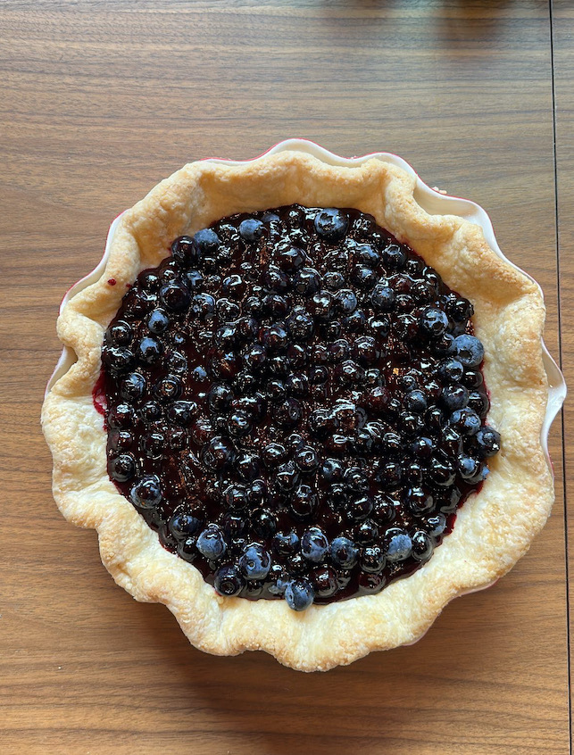

The secret to this blueberry pie is using fresh blueberries and leaving $1/2$ of them completely uncooked. Adding the raw blueberries to the sweetened, cooked ones gives the pie a wonderful fresh taste and a nice tart flavor to complement the sweetness. This is probably my favorite pie, and my go-to during the summer.

This recipe was passed down to me by a true southern gentleman named Frank.

## Ingredients

* 4 cups fresh blueberries
* 3/4 cup sugar
* 1 tablespoon butter
* 1/4 cup water
* 3 tablespoons corn starch
* 1 tablespoon fresh lemon juice
* a pinch of salt

## Instructions

### Cook your filling

Add 2 cups of blueberries, water, sugar, salt and cornstarch to a small pot or saucepan. On low heat, stir all the ingredients together. Continue stirring until blueberries break down and release their juices, around 10-15 minutes. Mixture should thicken and look like pie filling. Add butter and lemon juice.

### Add fresh blueberries

Toss in the remaining 2 cups of fresh blueberries into the cooked mixture, and stir to combine. Pour entire mixture into a pre (blind) baked crust. Oh, and the crust is important, [so please make from scratch using my recipe.](https://www.timabe.info/cooking/pie-crust)

### Chill

Chill in the refrigerator overnight or at least 4 hours. This pie is best served cold.