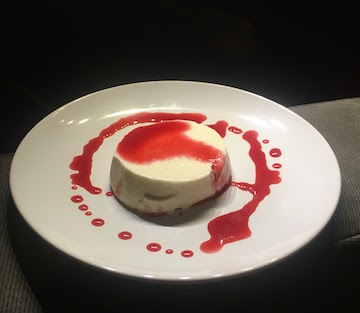

Panna Cotta is a perfect dessert. It's not too sweet or heavy. It looks and tastes elegant, and it's surprisingly simple to make.

The consistency of panna cotta is key. You don't want it to be too firm, like a flan. You also don't want it to collapse into a swamp of thick milkiness (although it will still taste great, but this dish is also about looks). Personally, I like to get it just ever so slightly above the threshold where it devolves into a puddle - barely holding its structure and jiggily enough such that a gust of wind will get it grooving on your plate. This is the [Mendoza line](https://en.wikipedia.org/wiki/Mendoza_Line) of panna cotta. Rather than wax too much more poetically on this, I'll show you what I mean.

If you agree that this is the ideal consistency, follow the recipe exactly. If a firmer panna cotta is more your thing, add 10% more gelatin. Any less and you're swimming.

## Data Driven!

Frustrated with all the different recipes out there, I embarked on my own delicious journey to create the best panna cotta. Each iteration I recorded and took notes on, until I finally felt confident that I had the ratios right. To see my data, [click here.](https://www.notion.so/timabe/1114ed6305e74c9b8e01b5c6ca388e10?v=4d3350e524394c708db5fd117728e739)

Or just read my recommendations:

* Dairy: 2 cups cream, 1.5 cups whole milk
* Gelatin: 7 grams
* Sugar 4 tablespoons

Yes, this dessert is on the lower side in terms of sugar and on the higher side in terms of fat. So it's basically the opposite of what they told us to eat in the '90s, but right on brand for what they're suggesting nowadays. 

## Ingredients

Makes approx 8 panna cottas

* 2 cups cream
* 1.5 cups whole milk
* 7 grams powdered gelatin
* 4 tablespoons sugar
* Vanilla - just a few drops
* Kosher salt - a tiny pinch

If you want to plate your panna cotta like in the gif above

* 8 4oz Ramekins
* Canola oil spray

## Instructions

If plating, lightly oil your ramekins (otherwise they'll be difficult to remove).

Pour whole milk in a shallow bowl and sprinkle powdered gelatin. Set aside.

Add cream to a saucepan and put over medium heat. Stir in sugar and pinch of salt. Stirring constantly, allow mixture to heat up until it is about to begin to boil. Once you've reached that, take off heat and stir in milk and gelatin, which should have tightened up a bit by now. Next, add a few drops of vanilla.

### Important but maybe optional: Cool down in an ice bath

This step is optional depending on what type of milk and cream you used. Basically, if you used some fancy expensive milk and cream to make your panna cotta, chances are it hasn't been highly homogenized (but has been pasteurized assuming you aren't using raw milk). On the other hand, cheaper and more national brands of milk are very homogenized. Why is this important? Homogenization helps with emulsification, or the blending of the fatty and watery parts of the milk. Highly homogenized milk will set very nicely and generally doesn't need much of a cool down period before going into the fridge. But if you are a fancy person, like me, and your family only buys expensive organic milk from local farms, omitting a cool down period after taking it off the stove can result in an end product that looks layered, with one layer less opague than the other and looking a bit watery. It will still taste the same, but it isn't a great look.

The solution is to create an ice bath to cool your hot mixture in before putting in dishes and sticking in the fridge. I use an instant read thermometer and aim to cool the mixture down to 65 degrees Fahrenheit.

Once the mixture is cool, pour into a oiled ramekins and refrigerate for at least 4 hours. 

To plate, run a thin paring knife along the ramekin's circumference. Place plate on top of ramekin, holding the two against each other, and rotate over so plate is on bottom. Give a medium "slap" to the top of the ramekin, and the panna cotta should slip out. Gently lift the ramekin off. 

## Flavors, sauces, etc.

Feel free to experiment with different panna cotta flavors. One that I've really enjoyed is strawberry. I'll blend up a handful of them with an immersion blender and strain to get all the seeds and pulp out. Then, when I mix the cream and milk/gelatin together, I'll add my strawberry juices. It comes out tasting like a light strawberry ice cream.

Sometimes I will make a fresh berry sauce, too, where I'll add a handful of raspberries or blackberries to a shallow saucepan and heat on low until they release their juices. Then I'll just strain out the seeds and, if it's needed, add a small sprinkle of sugar. I'll do this right after I make the panna cotta, and the sauce will thicken as it cools. Adding a sauce is another way to make this elegant dish even more impressive looking.

