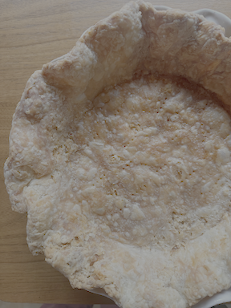
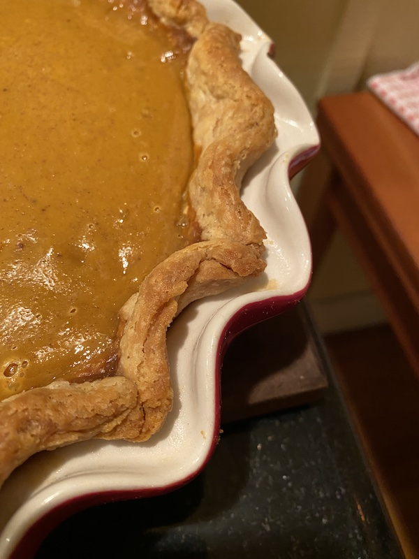

I don't eat a lot of desserts, so when I get an urge to make a pie, I always make this crust from scratch. This is an incredibly flaky pie crust. It takes a little bit of patience and a lot of butter. Makes a large enough crust to fit any pie pan and have some left over, because the last thing you want is for your crust not to fit.

## Ingredients

I used to use 1 stick of butter in my pie crusts, but I've found that they don't rollout quite large enough. Plus it's better to have it be bigger than you need and you can always trim off the leftover. So for this recipe, I start with 1.5 sticks of butter.

* Frozen Butter: 1.5 sticks, or around 172.5 grams
* Flour: 210 grams
* Ice Water: 55 grams
* A good pinch of salt

I use Challenge butter, which I buy and leave in the freezer just for pies. Precision normally isn't necessary, but in baking it is. I use a digital kitchen scale to get my weights precise. You can get one for about $10 on amazon.

## Equipment

* Food Processor or stand mixer (I use the former)
* Rolling Pin
* Plastic Wrap or gallon size ziplock bag
* Pie Pan
* Optional: Pie weights or something heavy if you are blind baking. More on that below.

## Instuctions

### Make the dough

Weight your ingredients. Take the frozen butter, chop it with a heavy knife into large chunks, and then by hand combine it with the flour. Pour in food processor and pulse a few times until the mixture looks like coarse crumbs. Add a pinch of salt. Pour in water and mix by hand until dough tightens up. 

Transfer mixture to counter or a silpat baking mat and start working it with your hands until it turns solid with very little crumbling. You'll feel like it's too dry, but keep going. It will come together. If you need to, add a bit of water. It's better for it to come together than be too dry, but a key to a flaky crust is to keep the water to the minimum.

Get the dough shaped into a flat disc. That will make it easiest when you eventually roll it out.

### Chill the dough

Wrap the dough disk in plastic wrap and pop in the refrigerator for at least 4 hours. This allows the gluten to develop, which holds the crust together. I generally shoot for overnight. 

### Roll out the dough

Take the dough out of the refrigerator. At this point it should be very stiff, and that's not always easy to work with. Let it sit on the counter for about 10 minutes and come closer to room temp. At that point, flour your surface and roll it out with a rolling pin, flipping it as necessary. [Here's a great, but somewhat long video from ChefSteps that I like on rolling out dough and blind baking it](https://www.youtube.com/watch?v=CHAcFvpjhyQ). You're goal is to get a big circle that will more than fit your pie pan. Again, youtube is your friend with regards to technique. 

### Line your pie pan

Once dough is rolled out, use your rolling pin to lift dough off your surface. Imagine you've unrolled some wrapping paper and now you want to roll it back up. Take rolling pin with dough to your pie pan and unroll it. Press dough down along inner circumference. As for the overhanging dough, either fold it back in or trim it off, depending on the look and feel you're ultimately going for. 

### Chill again before baking

Whether you're going to blind bake or not, chilling the dough after you've rolled it out prevents shrinkage. Put it back in the refrigerator for 20 minutes. 

## Blind Bake

Most pies, like my famous [banana cream](../banana-cream-pie) and [blueberry pie](../blueberry-pie), require a blind bake. I will even do this with [pumpkin pie](../pumpkin-pie). Even though a pumpkin pie is baked with the ingredients inside, if you don't blind bake it the crust turns out very raw.

To blind bake, poke holes with a fork in the bottom of your crust. Cut a piece of foil or parchment paper and lay it on the crust. Pour something heavy in - I use dried beans but pennies also work (or fancy pie weights, but that's not necessary).

Bake at 425 on convection for about 20 minutes. I like to put my pie on a cookie sheet, as the butter will melt and drip down a little. By putting it on a cookie sheet, you prevent the butter from dripping to the bottom of your oven, where it will later burn. 

After 20 minutes, remove pie weights and parchment/tin foil, lower the oven to 325 and continue baking another 10-20 minutes until crust turns golden brown. It may puff up a bit, but don't worry. It will deflate as it cools.