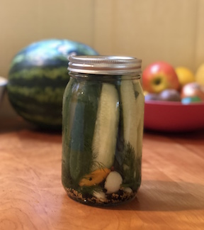

{width=400px height=400px}

**Update:** I have somewhat moved on from this recipe for pickles in favor of one using sous vide where I only make 2-3 jars at a time. The new method only takes about 1 hour, rather than a whole day. However, if you are looking to make 12 jars I still recommend going this route.

This is the recipe for my famous spicy dill pickles. These will honestly be the best pickles you've ever had. Making them will require a full afternoon, so you'll want to make a large quantity. This recipe is for around 12 quart jars. 

## Brine
* 12 cups white vinegar
* 12 cups water
* 1 cup kosher salt (Make sure it's kosher salt. 1/2 cup kosher salt != 1/2 cup table salt)

## Pickling Ingredients
* Pickling Cucumbers, cut in spears or chips. 5 lbs.
* Peeled garlic cloves. 2 heads worth.
* Fresh Dill. 2 bunches
* Hot peppers.
    + For really spicy, use 1/2 a habanero per jar
    + For medium, use one or two serrano peppers or a Thai chill.
* Mustard Seed
* Black peppercorns
* Fresh Grape Leaves (optional, but if you have them the tannins add a nice crunch to the pickles)

## Equipment

I made a [kit](www.kit.com) with all the equipment I use
<iframe src="https://kit.co/embed?url=https%3A%2F%2Fkit.com%2Ftimabe%2Fpickling-pickles" style="display: block; border: 0px; margin: 0 auto; width: 100%; height: 100vw; max-width: 700px; max-height: 700px" scrolling="no"></iframe>

## Instructions

### 1. Prepare the Jars

Sterilize your canning jars and lids in the large canner pot. Boil the water and drop them in for 20 minutes. Note: It takes a long time to boil such a large pot of water, so if you start with hot water that will save you some time. Use the heating time to prep your ingredients and make your brine. You can usually only do 6 or 7 jars at a time.

### 2. Prep your ingredients

Slice cucumbers in spears and/or chips. Slice the blossom end off each cucumber and discard. 

### 3. Make your brine

Combine all ingredients for the brine, and bring to a boil. Stir and make sure all the salt is dissolved. 

### 4. Fill your jars!

Once the jars are sterilized, brine is ready, and ingredients are prepped, you can jar them up. I usually start with the spices: mustard seed and black peppercorns. Put about 1 teaspoon of each at the bottom of the jar. Next, add a few cloves of garlic and a few sprigs of dill. Then, gather a bunch of cucumbers and a few peppers and put them in the jar. Pack tightly! You'll want these jars to last, so fill in all the airspace you can, but leave about a half an inch to spare at the top of the jar. I will sometimes add another sprig of dill and a few more garlic cloves at the top if there's room. 

Next, carefully pour your brine over the ingredients. Fill it enough to cover all the product. 

Once filled, take the processed jar lid and carefully place it on top of the jar. Make sure there isn't any food around the rim of the jar, as that could spoil on the shelf. If there is, just wipe the rim with a clean towel. Once the lid is on, take your metal band and screw it on, not too tight. 

Set your jar aside for now, and continue filling the rest until all the jars from your canner are filled with pickle goodness.

### 5. Process your pickles

You could eat these in the next week, but the patient pickler processor who waits a month will be rewarded with a much tastier product. The flavors need time to develop. I'm going to explain two methods to process your pickles, but first, *why process?*.

Processing will create an airtight vacuum seal for your jars, shutting out any bad microbes. Heating the pickles also kills any microbes that might be in there at the time of canning. By processing your pickles, you can store them on the shelf up to 12 months, so it's a good thing to do if you're making a lot of product. Otherwise, you should store your jars in the refrigerator and eat within 1 week.

Also, if you're concerned about safety, pickling provides an extra layer of security. As the brine is very acidic, it is hard for anything to grow in there. This makes pickles a much safer product than, say, jam all things else being equal.

#### Method 1: Back in the canner

Take some water out of the canner so the closed jars will fit without overflowing. Make sure the water is boiling, and place all the jars in the canner ensuring they're fully covered with water. A jar lifter will make your life a lot easier here. Close the lid and boil for 10 - 15 minutes. Take the jars out and set aside to cool. Within minutes, you should start hearing "pop!" sounds. These sounds are created by the lid vacuum sealing. It means your pickles are now shelf stable. 

The only downside to this method is that putting the pickles in a vat of 200+ degree water can soften them and reduce their crisp crunchiness. If this is an important issue to you, and you have a sous vide tool, check out method 2.

#### Method 2: Sous Vide

As you may know, I'm a [huge fan of sous vide cooking](../blog/joule-product-review)*. Sous vide gives you complete control of the temperature of your water bath. So instead of processing in boiling water for 10 minutes, you can heat the water to a lower temperature - just enough to kill off the microbes and create a vacuum seal - and hold it in that water for longer. This results in a less soggy product at the end of the day. 

I borrowed this method from the [chefsteps recipe](https://www.chefsteps.com/activities/make-crisp-flavor-packed-pickles-on-the-quick). First I fill a cooler with water, then I put the sous vide device in and set it 140&deg;F, which is the point of pasteurization. Set the timer for 2 and a half hours, and when the timer is up, take the jars out and set them on the counter. 

I've noticed that the jars take longer to "pop" when I use the sous vide method. Be patient, they will pop. I've freaked out about this in the past, so I'm telling you now to not worry.

### 6. Wait as long as you can before eating

Once jars are processed, store in a cool place.

I know you'll want to crack open a jar right away. Honestly, it's fine to do that. But the pickles get better with time, and the sweet spot is really 4 to 5 weeks. By then, the peppers will have leached their spice into the brine, and your pickles will be just about the tastiest pickles you've ever had. 