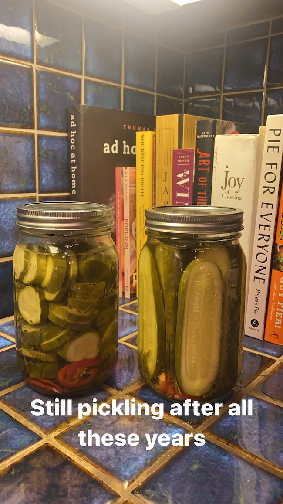

For many years, [this old recipe was my tried and true pickle recipe](https://www.timabe.info/cook/spicy-dill-pickles). But at some point I realized that setting aside an entire afternoon to make 12 quarts of pickles was a little overkill. This recipe is far easier, and produces results that are just as good. What's even better is that it's scalable, so you can do 12 jars if you want . . . or maybe you can just make 1 jar. I usually make 2 or 3 at a time, which will last me a couple months. 

## What makes this recipe great

In my old recipe I would first run my jars through the dishwasher. Then, I would take a giant canner and fill it with water. I'd boil that water and sterilize my jars. Then, after filling them up with the cucumbers and brine, I'd post-process them in the canner. I could usually do about 6 jars at a time in the canner, so I'd have to do two cycles of sterilizing and processing to make 12 jars. Heating up the canner full of water to a boil would take at least an hour. This would lead to an all day production, where the house would be hot and smelly from boiling water and brine all day. 

In this new recipe, I skip the dishwasher and canner all together. I process the jars using sous vide, which takes about 2 and a half hours but all that time is idle time. I simply boil a kettle of water to give the jars a quick sterilization before filling them. When I first started pickling I would get very nervous about keeping everything sterile, fearing something like botulism, which is no joke if you get it. Since then, I've learned that cases of botulism are super rare - only around a dozen or so are reported in a year. They also tend to come from spoiled foods that are low in acidity, which means that almost 100% of the cases are from potato salad that is left out in the sun for hours and hours. With pickles, since they live in a heavily vinegar-ed solution, botulism is simply not a risk. Sill, just to be careful I'll pour boiling water in my jars and leave them alone while I cut up my cucumbers.

By removing the dishwasher cycle and the canner, I'm able to shave off 90% of the prep time of the old recipe. I simply boil water, pour it in my jars, cut up my ingredients, add them to the jars, and then leave them in a sous vide water bath unattended. So you can do this all in under 45 minutes.

## Data Driven! 

With this new recipe, I tend to only make 2-3 jars at a time. One of the advantages of this is that I get to make the recipe much more often, which means I can experiment and learn faster. Since my professional life involves a lot of experimentation and data driven decision making, I began keeping track of the parameters in each of my recipes, slowly adjusting certain ones until I felt like I had nailed the results. [If you'd like to take a look at my notes, check it out here](https://www.notion.so/timabe/Pickles-5dba3093f0194f3eb7e33cf5f6564a6b). Ultimately, what I found what that the right parameters for pickles are the following:

1. A 40/60 vinegar to water ratio for the brine.
2. 4.5% salt, by weight

# Ingredients

## Equipment

* Quart jars
* Jar lids 
* Jar bands
* A Sous vide device. My favorite is the [Joule](https://www.williams-sonoma.com/products/breville-joule-sous-vide/?catalogId=79&sku=3592319&cm_ven=PLA&cm_cat=Google&cm_pla=Electrics%20%3E%20Sous%20Vide&region_id=820120&cm_ite=3592319&gclid=CjwKCAjwieuGBhAsEiwA1Ly_nf0l-yvqzSTBin33CYJVVI1uWHKjxJFzJDk7NB-DyVKbGCJEjs7sRBoCY_UQAvD_BwE).

## Brine

* White vinegar
* Water
* Kosher salt
* Mustard seed
* Dill seed
* Black peppercorn
* [Optional] Bay leaves

As mentioned above, the vinegar to water ratio should be 40/60. Then, you weigh your vinegar and water mixture, multiply it by 4.5%, and that's how much salt you should add. Here's an example, and this will be enough brine for 2 jars.

* 2 cups water
* 1.3 cups white vinegar

For me, this weighed out to 753 grams. That meant I added around 33.8 grams of salt. As for the spices, would recommend about a half a teaspoon of each per jar you are going to make. Maybe a bit more of the black peppercorns. The ratio here is less important. If yo decide to use bay leaves, I'd go with one per jar.

## Pickling Ingredients

* Pickling Cucumbers, cut in spears or chips.
* Garlic
* Fresh Dill
* Fresno chile peppers

# Instructions

Measure and pour all your brine ingredients into a pot and bring to a boil. I find that boiling all the spices in the brine leads to a nicer flavor, but you can put the spices in later if you like. 

Bring a kettle of water to a boil and pour the boiling water in the jars you plan on using. There is no need to soak the jar bands or the lids in boiling water. While the jars are getting sterilized in the boiled water, cut up your cucumbers and peppers and peel your garlic. I like to make one jar of spears or halves, and one jar of chips. I find that slicing the Fresno chillies on a mandoline gives them a really cool look in the jars. 

Meanwhile, prepare a water bath with your sous vide device. Make sure it's large enough to accommodate your jars, and that the water will cover the tops of them. Set this to 140 degrees fahrenheit.

Once your ingredients are prepped, carefully empty the water from one of your jars. Fill it up. Start by adding a sprig of dill, some chillies, and a few cloves of peeled garlic. Then, try to cram as many cucumbers as you can into the jar. If there's extra space, add more garlic cloves or peppers. When the jar is nicely packed, pour the brine until you get to the top of the jar. Make sure to spoon some of the spices in your brine in there, since they will have sunk to the bottom of your brine pot. I'll sometimes strain them out from the brine first so they become easier to add in. 

Once filled, put a jar lid on and screw on a jar band. The band doesn't need to be tight, just enough so that it's not going to come off. Do the same for the remaining jars.

## Processing

Once the jars have been filled and topped with the lids, place them in your water bath and set a timer for 2 and a half hours. When the timer is up, take the jars out and set them on the counter. Within 30 - 120 minutes you'll hear them "pop", which means the lid has properly sealed. If your jar doesn't seal, which sometimes happens, don't worry! Just put your jar in the fridge and it'll basically stay edible for 2-3 months just like a normal jar of pickles that have been opened.

## How long to wait

I used to leave my pickles alone in a cool dark place for at least 5 weeks before digging in. I've found that while waiting a few weeks is better, it doesn't make a huge difference. I'll generally open one of my jars up the next day, knowing I have one or two other jars that I can let "age". So no need to treat patience as a virtue here. 

