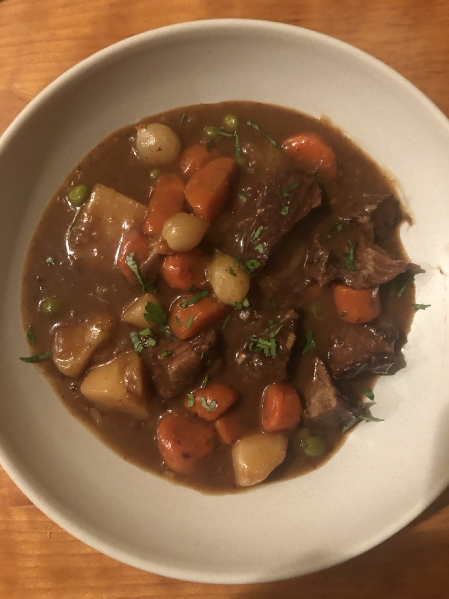

# Best Beef Stew

This hearty beef stew is perfect for cold days, offering rich flavors and tender meat. The recipe involves a few key steps: preparing a garlic-anchovy paste, browning the beef, sautéing vegetables, deglazing with wine, and slow-cooking in the oven with herbs and broth. Potatoes are added midway, and the stew is finished with pearl onions and peas for added depth and sweetness.

**Source:** [My Year Cooking with Chris Kimball](https://myyearwithchris.wordpress.com/2011/04/03/best-beef-stew/)

## Ingredients

-   **Garlic-Anchovy Paste:**
    -   2 garlic cloves, pressed
    -   4 anchovy fillets
    -   1 tablespoon tomato paste
-   **Beef:**
    -   4 pounds boneless beef chuck-eye roast (look for well-marbled meat)
    -   2 tablespoons olive oil
-   **Vegetables:**
    -   1 large onion, halved and sliced into 1/8-inch-thick slices (about 2 cups)
    -   4 medium carrots, peeled and cut into 1-inch pieces (about 2 cups)
    -   1 pound Yukon Gold potatoes, scrubbed and cut into 1-inch pieces
    -   2-3 Celery Ribs
    -   1 cup frozen peas, thawed
-   **Other:**
    -   1/4 cup all-purpose flour
    -   2 cups red wine
    -   2 cups chicken broth
    -   2 bay leaves
    -   4 sprigs fresh thyme
    -   2 teaspoons salt
    -   1 teaspoon ground black pepper
    -   1 packet unflavored powdered gelatin (2 teaspoons)

## Instructions

1.  **Prepare the Garlic-Anchovy Paste:**
    -   In a small bowl, combine the pressed garlic and minced anchovy fillets. Use the back of a fork to mash them into a paste or use a mortar and pestle.
    -   Mix in the tomato paste and set aside.
2.  **Prepare the Beef:**
    -   Trim excess fat from the beef and cut into 1 1/2-inch cubes.
    -   Pat the beef dry with paper towels; do not season.
3.  **Brown the Beef:**
    -   Heat 1 tablespoon of vegetable oil in a large Dutch oven over high heat.
    -   Add half of the beef cubes (or a third if using a larger roast) and cook until well browned on all sides, about 8 minutes. Adjust the heat if the oil starts to smoke or the fond begins to burn.
    -   Transfer the browned beef to a large plate and repeat with the remaining beef, adding another tablespoon of oil as needed.
4.  **Sauté the Vegetables:**
    -   Reduce the heat to medium
    -   Add the sliced onion and carrot pieces. Cook for 1 to 2 minutes, stirring to scrape up the fond from the bottom of the pan.
    -   Add the garlic-anchovy-tomato paste mixture and cook for 30 seconds until fragrant.
    -   Add back the beef
    -   Stir in the flour and cook for another 30 seconds.
5.  **Deglaze and Simmer:**
    -   Slowly add the red wine to deglaze the pan, scraping up any browned bits.
    -   Increase the heat to high and simmer for 2 minutes.
    -   Stir in the chicken broth, bay leaves, thyme sprigs.
    -   Bring the mixture to a simmer, cover, and transfer to a preheated 300-degree oven.
    -   Cook for 1 1/2 hours.
6.  **Add Potatoes and Celery Continue Cooking:**
    -   Add the potato pieces and chopped celery, cover, and return to the oven.
    -   Cook for an additional 45 minutes.
7.  **Finish the Stew:**
    -   Remove the pot from the oven and place it on the stovetop over medium heat.
    -   Skim any excess fat from the surface.
    -   Add the thawed pearl onions and cook for 15 minutes.
    -   In a small bowl, sprinkle the gelatin over 1/2 cup of water and let it soften.
    -   Stir the softened gelatin and thawed peas into the stew.
    -   Season with salt and ground black pepper to taste.
    -   Cook for an additional 5 minutes until the peas are heated through.
8.  **Serve:**
    -   Ladle the stew into bowls and serve hot with crusty bread or over mashed potatoes.

## Notes

-   **Herb packet:** Putting all your herbs in a cheesecloth sachel is helpful for when you later need to discard them.
-   **Cooking Tip:** Browning the beef in batches ensures a good sear and enhances the stew's flavor. Avoid overcrowding the pan.
-   **Make-Ahead:** Cooking the stew a day in advance and reheating it can deepen the flavors, though the beef may break down more upon reheating.
