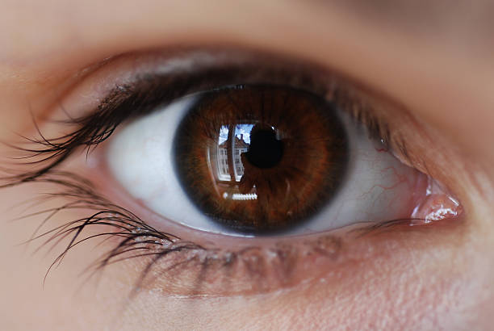
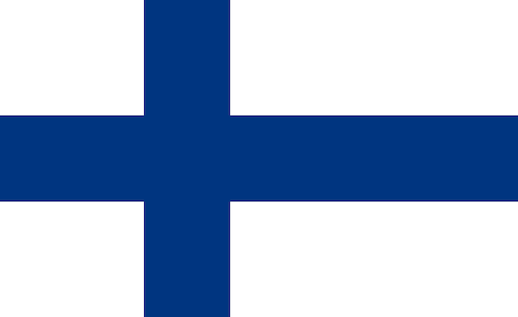
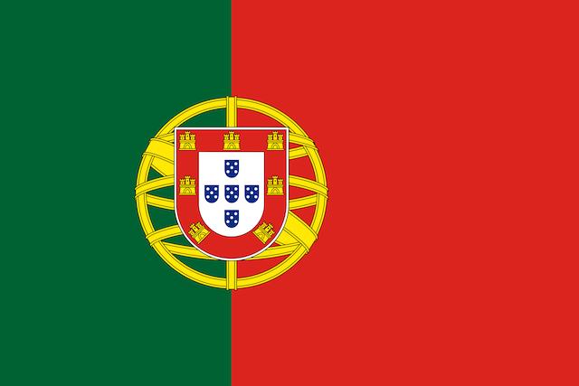
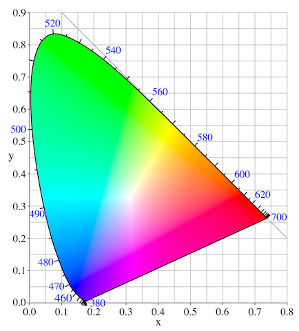
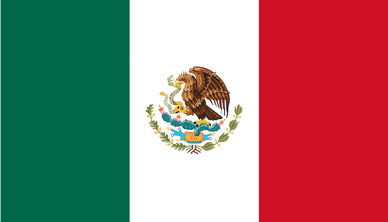
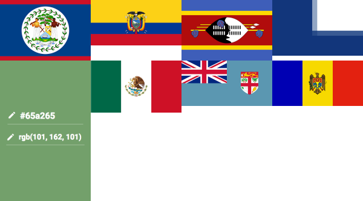
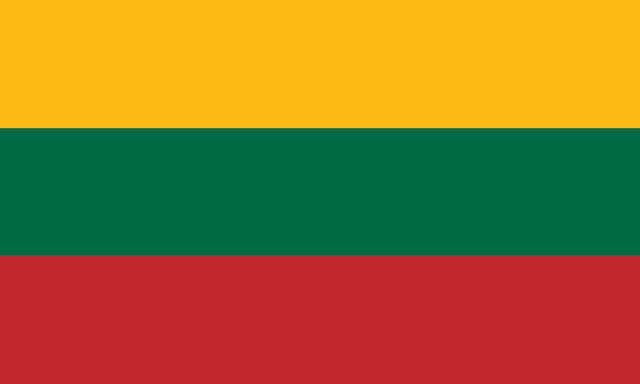
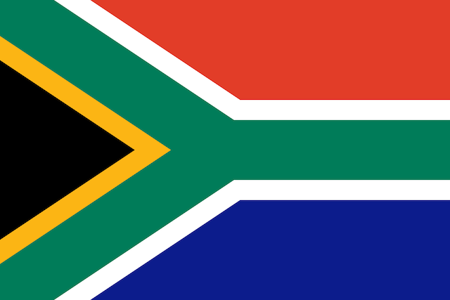

The other day I was trying to think of a good trivia question, and this one popped into my head:

> What country's flag has the most colors? 

It's a hard question, right? It's easy to think of flags with two colors (Japan, China) and even easier to think of flags with three colors. In my head I can think of maybe one flag with 4 colors although I can't think which country it belongs to. But are there any flags with 5 or more colors? 

Instead of doing what any normal person should do, which is just to Google the answer, I did something really dumb instead. I tried to solve the problem using a computer. What follows is part cautionary tale, part fun data exploration, part history lesson, and part philosophical waxing on very cerebral questions like what it means to be human. We'll play with multi dimensional matrices, look at a bunch of very pretty flags, and learn about a not so secret society called the International Commission on Illumination that sounds like something Dan Brown might reference in the Da Vinci Code, part 2. 

Of course, you could also just Google the answer. But, c'mon and follow me down this rabbit hole.

## Computers spoil everything

As humans we are incredible at pattern recognition and classification. Practically every living and non-living thing in this world is a unique collection of molecules, yet we're very good at clumping these molecule collections into generalization things like elephants, bamboo trees, and Grecian urns. Imagine if we lacked this ability (or read the Borges short story [Funes, his memory](https://faculty.washington.edu/timea/art360/funes.pdf) which is about a man who falls off a horse and gains perfect memory, therefore making normal human pattern classification unnecessary). Computers, like Funes, are very good at being absolutely precise. That's almost the definition of a computer. Everything on a computer is represented in ones and zeros. Humans don't need to understand the details of how we store and process information to understand the information itself.



Take the humble brown eye. When I look at the photo above, I know immediately that I'm looking at an eye and the color of the eye is brown. How I am able to know that immediately is a mystery yet to be solved and would require full knowledge of how our brains work,  but the beauty is that we're here and doing just fine without knowing how that sausage is made. Once we fully understand that, I'm fairly confident that all hell will break loose and we'll kiss goodbye whatever it meant to be human, so let's just be blissful about our own ignorance. 

How might a computer arrive at the same conclusion that this is a brown eye? Well, first we have to convert the physical, real world brown eye into a digital representation, which has already been done. That digital representation is a collection of over 250,000 pixels. Each of these pixels is represented by a hexadecimal value which corresponds to a combination of a certain about of red, green, and blue. If you look closely at the iris, you'll see that there are many shades of brown, and even some blue, red, and white in there due to the reflection of a window and building in the eye. Yikes, the devil is in the details. Whereas our brains can ignore the reflection and the many unique colors and simply label this "brown", a computer gets all boggled down in the details. And keep in mind that I'm only talking about the iris, whereas the photo also includes the whites, the veins, the pupil, and the skin. 

Am I getting too abstract? Well I'm just getting started. But let's get a bit more concrete here in terms of what the image actually means in to the computer with a code example in R. If you've never played around with image data in R, well you're just like me before I embarked on this journey. I'll try to go slow and explain what's going on. We'll use the [colordistance](https://cran.r-project.org/web/packages/colordistance/index.html) package to load the photo into R, where it will be represented as a list of 4 elements. One of these elements, called `original.rgb`, is a 3-dimensional array that can be interpreted as

* 410 rows
* 612 columns
* 3 channels of weights, corresponding to the redness, greenness, and blueness of the pixel


```{r eye example}
library(colordistance)
library(tidyverse, warn.conflicts = F)

# load the image as a list of 4 elements
eye_list <- loadImage("images/brown_eye.jpg")
# take the list element named "original.rgb"
eye_rgb <- eye_list[["original.rgb"]]

# verify that this is a 3-dimensional array like I explained above
dim(eye_rgb)
```

Let's look at the first pixel in the image.
```{r eye pixel} 
eye_rgb[1,1,1:3]
```

So the first pixel has a weight of `0.78` red, `0.68` green, and `0.63` blue. Rather than representing this as a mixture of three different colors, it makes more sense and is more generally recognized in computer land to refer to this as one color and to use a hexadecimal representation for that. 
```{r rgb}
# convert these 3 weights to a hex value
rgb(
  red = eye_rgb[1,1,1],
  green = eye_rgb[1,1,2],
  blue = eye_rgb[1,1,3]
)
```

If you like, you can type [this hex value into google](https://www.google.com/search?q=%23C7ADA0+color) and verify that it matches the skin color in the upper left of the photo.

We can use a similar process to figure out how many colors there are in total in this photo. We'll apply the `rgb` function to the 3 color channels to flatten down the array into a 2 dimensional matrix of hex values (I love `purrr` more than anyone, but it's not designed to work on arrays and matrices, so we'll go old skool). Then we'll tabulate the hex values, convert it to a tibble, and sort it by count.

```{r total eye colors, message=FALSE, warning=FALSE}
eye_hex_values <- apply(eye_rgb, MARGIN = c(1,2), function(x) rgb(x[1], x[2], x[3])) 

tabled_hex_values <- table(c(eye_hex_values))

hex_df <- tabled_hex_values  |>  
  as_tibble(.name_repair = make.names) |> 
  arrange(desc(n)) |> 
  rename(hex_value = X, cnt = n) |> 
  mutate(percent_of_total = scales::percent(cnt/sum(cnt)))
hex_df
```

This is a long, but hopefully didactic way of saying that this photo of a brown eye is more than meets the eye. While I can apologize for that bad pun, I can do nothing about the fact that this photo contains exactly 42,861 unique digital colors. And it's not like one color dominates, either. The most common color `#C9AEA3` represents just over one half of one percent of the photo. And you thought 50 shades of grey was a way to say things are complicated!


Even the most discerning human eye would have trouble describing more than a dozen or so colors in this photo, yet a computer is able to tell us precisely that there are 42,861 colors all of which represent less than 1 percent of the total image. And this basically sums up what computers are good at (telling us there are 42,861 colors), and what humans are good at (telling us this photo is brown, white, flesh colored, and black). And this is why computers spoil everything. How can I get the computer to tell me the colors of this photo in the fast and loose, heuristic driven world that we humans live, breathe, and communicate in?

# Organic to symbolic

Here in our analog world, the above way of thinking gets us into even more trouble because colors exist on a continuous scale making my iris an infinite number of colors! Fortunately, thinking about that doesn't keep me up at night and I'm easily able to abstract it away, call it brown, and fall asleep to YouTube videos. We have no trouble taking the continuous color spectrum of the organic world and dividing it into a discrete number of colors that we can give names to. What's even cooler, though, is that we partition that space differently depending on the context. I use a different partition of colors if I'm teaching a kindergarten class than if I'm discussing Rothko with the type of artsy people that keep the Pantone Color book on their desk.
 
Colors, the way we speak about them, are more like symbols. If you've read the book <a target="_blank" href="https://www.amazon.com/gp/product/0062316117/ref=as_li_tl?ie=UTF8&camp=1789&creative=9325&creativeASIN=0062316117&linkCode=as2&tag=timabe-20&linkId=49a9c4f0e06fc4d001cd369b48b5cf24">Sapiens</a>, you know that it's our ability to think and communicate in terms of symbols that differentiates us from other animals (and if you haven't read it, I highly recommend reading it!). As humans, we've organized our lives around symbols and you could argue that none looms larger over our lives than the good old modern nation state. Somewhere in history, we decided to create these colorful banners to advertise which nation state we belong to and flags were born. As flags are man-made symbols, they tend to be based on simple colors and shapes. When a feudal lord decided to hop on the nation state bandwagon and create a flag, he used the simple notion of colors - the one we learn about in kindergarten when we are given our public school issued box of crayolas. Which brings us back to our original question: which flag has the most colors? Luckily, flags are symbols based on simple colors so we shouldn't run into the same kinds of problems we did with the iris when the computer told us it was over 40,000 different tiny colors. 

That's what I thought at least, going into this. . . 

## Finland



Most people wouldn't argue with this statement: The flag of Finland, displayed above, has two colors (blue and white). Let's see if a computer would agree with that. We'll carry out the same analysis we did above. This time we'll create our own function for reusability.

```{r color counting function}
color_count <- function(path) {
  # load image and select the original rgb representation
  image_list <- colordistance::loadImage(path)
  image_rgb <- image_list[["original.rgb"]]
  
  hex_values <- apply(image_rgb, MARGIN = c(1,2), function(x) rgb(x[1], x[2], x[3])) 

  tabled_hex_values <- table(c(hex_values))

  # return in dataframe format
  tabled_hex_values |> 
    as_tibble(.name_repair = make.names) |> 
    arrange(desc(n)) |> 
    rename(hex_value = X, cnt = n) |> 
    mutate(percent_of_total = cnt/sum(cnt))
}

color_count("images/flag_images/fi.png")
```

The computer is a lot closer to agreeing with us than with the case of the brown eye. It finds that 60% of the image is white, and about 39% is a particular shade of blue. However, what the hell?! It somehow identified 5 other colors, none of which account for more than 1% of the total image. To see what's going on here, let's zoom in on the part of the flag where the blue crosses.


When you zoom in there really close you can see that the colors blend at the edges to form a few different shades of blue. Why this is the case, I'm not sure. If I had to guess, it would be related to the `PNG` file format, which will pixelate when resized or converted from a vector based graphic. In any case, it certainly complicates something that I thought would be relatively straight forward. Such is life, right? Let's trudge on.

In the case of Finland, we can easily use our judgement and say the the first two colors, which comprise over 99% of the image, are the only two colors that matter. Unfortunately, this simple rule won't work for our entire set of flags. If we rule out any hex value comprising less than 1% of the total image, we will get false negatives and false positives. A false negative can be seen on the flag of Portugal. Most people would say this flag is red, green, yellow, white and blue. However, the blue shields on the flag turn out to represent only 0.4% of the total, so our simple 1% threshold would fail to detect a color that human intuition easily detects.



An example of a false positive would be Swaziland. I'd say the flag is blue, yellow, red, black, and white. 


But when we use the 1% cutoff, we see two different shades of blue. They're almost imperceptible to the human eye, and [one (#3E5EB9) represents 36%](https://www.google.com/search?q=%233E5EB9+color) whereas the [other (#3D5DA7) only represents 1.8%](https://www.google.com/search?q=%233D5DA7+color). 

```{r swaziland example}
swaziland_path <- file.path("images/flag_images/sz.png")
color_count(swaziland_path)
```
Clearly, these should both be treated as "blue", right? Let's look into how we might fix that.

## Illuminate me, please

I'm sure we've all at some point seen some version of the color spectrum. If not, below lies a famous one which was created long before modern computers were around, in 1931 by the International Commission on Illumination. Yes, I told you we'd get to that and yes, it is a real thing. In 1931, this wacky bunch convened to decide on the world's first quantitative measure of color. What I would give to go back in time. . . Anyway, the colorspace they settled on was based on the three types of cones in our eyes which are receptive to red, green, and blue. Therefore, using the scientific knowledge of the time, they defined all colors as combinations of some amount of red, green, and/or blue. I'm trying to stay out of the weeds here, and to be honest this stuff is a little over my head, but I'll include some interesting articles at the bottom of this essay for readers who want to get in the weeds.



Having a quantitative scale for colors yields two cool results. One is that we can better communicate colors. So a graphic designer doesn't have to call the printer and say "can you reprint and add just a little more blue?". She can just relay the RGB values she wants and expect them to be rendered faithfully. Secondly, where there's numbers there's math. With the RGB scale, we can perform all our favorite math things with colors like addition, subtraction, distance, multiplication, clustering, binning, etc. 

Let's go back to our Swaziland example, where I mentioned we have two very similar shades of blue, leading to a false positive when we use our naive rule of filtering out colors at the 1% level. Our brains told us we were looking at just one blue, and with the RGB colorspace we can now speak objectively about them. Below is a glimpse of a random sample of the pixels in the Swaziland flag, plotted in the three dimensional RGB space. There's a simple function in the `colordistance` library to do this called `plotPixels`.

```{r}
loadImage(swaziland_path) |> 
  plotPixels(n = 1000, lower = NULL, upper = NULL)
```

We can see the blue values, and we can also see that they're very close in the RGB 3 dimensional space. Don't you just want to reach your hand in there and squeeze them together? The same is noticeable for black, brown, grey, and red colors. Normally, when we have continuous data like this and we want to reduce it into something more discrete, we have two go-to methods: Clustering and Binning. And of course, the `colordistance` package has functions for clustering and binning colors (what a great library!). Which one do we want? Well think about it. Clustering colors, which is done using k-means, requires us to state the number of clusters *a priori*. But our whole goal of this essay is to have the computer tell us how many colors there are. So we want to stay away from any method where we tell the computer to work with a number we're giving it ahead of time. Binning on the other hand, is a technique that divides a space into equal sized ranges, and counts the number of observations in each range. To see what I mean, let's bin the colors of the Swaziland flag.

```{r bin swazi, echo=TRUE}
sz <- loadImage(swaziland_path) |> 
  getImageHist(bins = c(3,3,2), lower = NULL, upper = NULL, title = "Swaziland Flag Color Bins")
```

The function `getImageHist` divides the RGB space into as many as 27 mini-cubes (although I found that using 18 works the best with the flag data). Any pixels in a given cube get averaged together, counted, and displayed on a bar chart. And as you can see, this method solved our false positive, merging the two very close blue pixels into one blue color. So this color binning method seems like a great tool to get us closer to answering the question at hand: Which flag has the most colors?

Of course, color binning is not a panacea. In the case of Swaziland, note that there are still some very small bins representing colors we probably would not subjectively say exist as distinct colors in the Swaziland flag. One example is the dark red bin representing the second bar. This color is probably a result of the pixelation around the red/blue borders of the flag. It's not something we're supposed to see distinctly. So if we want to use this binning method to count colors, we'll still have to find some cutoff value to throw away these edge colors. 

There's another thing I haven't brought up yet, too. I know, you're thinking this is getting too long, but hopefully some part of you finds this entertaining too. Remember, the journey is the destination.

## Beware of Seals: A digression


No, I'm not talking about seals that may have developed a taste for mammal blood. I'm talking about something far scarier, murkier, and problematic. You see, while most flags are just a nice and simple arrangement of colorful shapes, some countries decided to buck that trend and use illustrative seals on their flags. Why is this a problem for us? Let me show you. Exhibit A: Nicaragua


While some might say this flag is blue and white, it's also got this colorful seal smack in the middle with a RAINBOW of all things. So what do we make of this? Where do we draw the line? This isn't a one-off either, a lot of flags have seals and they are pretty damn colorful. Some, like Mexico, are quite illustrative with color gradients that even our old friend Betsy Ross would have told us can't be sewn. The Mexican flag brings up a lot of other questions, too. How much of the color and design of the eagle is up to the artist, and how much is government mandated. At what size/scale does the flag need to achieve what level of detail? Are there government guidelines outlining this? 



It just keeps getting messier and messier, but we're already in too deep so don't look back. Let's get back to the problem we noticed before this digression, which is that our color binning technique still leaves behind trace levels of colors that a human would never notice. You can probably guess that flags with seals will amplify this problem, since seals have a lot of detail which leads to gradation and blurred lines. Let's call these the "long tail of colors". 

## Cutting the tail

Towards the beginning of this essay I proposed a dumb heuristic to deal with the long tail of colors. I hoped that removing any color comprising less than 1% of the total image might work, but in practice it led to some false positives and negatives (Portugal and Swaziland being the two examples we used). Let's see if we can use the color binned data to come up with a more principled threshold. First though, I realize we haven't touched upon something extremely important: our data set.

The flag data I've been using comes from [flagpedia](http://flagpedia.net/). You'll see that they have an option to download all the flags of the world in one zip file, and that they have 4 different image resolutions. I used the `high resolution` set for this analysis. It's large enough to show good detail on the flags that have seals, while not too big to overwhelm your CPU on tasks like pixel counting and binning colors (if you have a GPU I'm sure you could use that, but if you have a GPU you probably stopped reading this awhile back and went back to your deep learning project). The files in the zip are `PNGs` and each country is identified by it's two letter ISO code. 

The first thing we want to do is prepare a nice data frame with all this data in it. I simply created a vector of flag images by reading the files in the directory and removing the `.png` file ending. Then, using the [countrycode](https://cran.r-project.org/web/packages/countrycode/countrycode.pdf) package, I was able to get the official country names for all the ISO codes. I also added the continent for good measure.

```{r flag_df, warning=FALSE}
flag_dir <- file.path("images/flag_images/")
flag_images <- list.files(flag_dir)

library(countrycode)
flag_df <- tibble(
  flag_file_name = flag_images,
  iso_code = stringr::str_remove(flag_images, ".png"),
  country = countrycode(iso_code, origin = "iso2c", destination = "country.name"),
  continent = countrycode(iso_code, origin = "iso2c", destination = "continent")
)
```

Next, we want to apply the color binning sequence to all our flags. This takes a little while with the large images, so if you're playing along at home you may want to use smaller images or just wait the ten minutes it takes with the large ones. I decided to write a function that takes the filename as an argument, loads it, bins and counts the pixels, converts the RGB values into its hex value, and calculates the percentage of the total each color bin comprises.

Then I simply map that function to each file in our data frame.

```{r pixel_bins, message=FALSE, warning=FALSE, cache=TRUE}
pixel_bins <- function(iso_code, bin_vec = c(3,3,2)) {
  
  flag_png = str_c(iso_code, ".png")

  color_bins <- colordistance::getImageHist(file.path(flag_dir, flag_png), 
                                            bins = bin_vec, 
                                            plotting = F, 
                                            lower = NULL, 
                                            upper = NULL
                                            ) |> 
    as_tibble() |> 
    mutate(hex = rgb(r, g, b)) |> 
    arrange(desc(Pct))
  
  return(color_bins)
  
}

flag_color_df <- flag_df |> 
  mutate(color_bins = purrr::map(iso_code, pixel_bins)) |> 
  unnest(color_bins) |> 
  group_by(country)
```

Now that we have our 18 color bins for each flag, let's look at the distribution of color percentages. Since we're interested in the long tail, we'll use a log scale.

```{r message=FALSE, warning=FALSE}
flag_color_df |> 
  filter(Pct>0) |> 
  ggplot() + 
  geom_histogram(aes(Pct)) + 
  scale_x_log10() + 
  geom_vline(xintercept = 4e-03, color = 'red') +
  ggtitle("Distribution of color percentages")
  
```


We end up getting a bi-modal distribution. What are these two modes? Well the one to the right on the chart represents large color areas - the big, solid shapes of color we normally associate with flags. As that distribution tails off to the left, we get colors representing anywhere from 10% down to around 0.5%. These are mostly going to be colors that we'd be able to detect, but might represent small details of a flag like the blue shields in the Portuguese flag or the brown eagle in the Mexican flag. The second mode peaks around 0.01%. Anything representing this small of a percentage is likely to be borders or gradients, like the weird stuff we saw when we zoomed in on the Finnish flag or perhaps shades of brown gradation in the Mexican flag's eagle that got color-binned in separate boxes from the primary brown color. Even though these colors are real, they don't feel in the spirit of the question we're trying to answer. Just to convince you, let's find a random flag with a binned color representing around 0.01% and see if we can detect it.

```{r}
set.seed(5446)
flag_color_df |> 
  filter(between(Pct, 9e-05, 2e-04)) |> 
  ungroup() |> 
  sample_n(1) |> 
  select(country, Pct, hex)
```
Pakistan is our random example. Let's look at the flag.


This is a good example, because this flag is clearly supposed to be just green and white. The color binning technique, however, found that 0.01% of the pixels in the image belong to a color bin distinct from the green and white color bins - a light green color that must represent the edges of the green and white areas.


So where do we draw the line exactly? That's hard to answer perfectly, but based on the shape of the distribution I feel that anything in that second mode probably doesn't deserve to be counted as a real color. Thus, I'm making the call to draw the line at 0.4%, which you can see in the red vertical line of the histogram. In the end, my initial guess of 1% as the cutoff wasn't too far off! If anything, this essay is a tribute to human intuition.

# Back to the main question

At this point, we can start answering the big question. What flag has the most colors of them all? 

```{r}
winners_df <- flag_color_df |> 
  # remove any colors that fall below our threshold
  filter(Pct > 4e-03) |> 
  count(country, sort = T)

winners_df
```

Belize wins it, with 9 colors. Next we have Ecuador with 8, Mexico with 7, and five different countries with 6. Let's have a look at our winners. I'm using the [imagemagick](https://cran.r-project.org/web/packages/magick/vignettes/intro.html) package to stitch all these images together. 

```{r message=FALSE, warning=FALSE}
winner_flags <- winners_df |> 
  filter(n>=6) |> 
  inner_join(flag_df, by = "country") |> 
  pull(flag_file_name)

library(magick)
top8 <- map(file.path(flag_dir,winner_flags), image_read) |> 
  map(image_scale, geometry = "150") 

top4 <- image_append(c(top8[[1]], top8[[2]], top8[[3]], top8[[4]]))
bot4 <- image_append(c(top8[[5]], top8[[6]], top8[[7]], top8[[8]]))
image_append(c(top4, bot4), stack = T) |> 
  image_write("images/top8.png")
```


This is a beautiful array of flags, don't you think? It makes me wonder why some countries go with a 2 or 3 color flag. These are really lovely to look at! You may have noticed that all these flags besides the one in the lower right (South Africa) are flags with seals, crests, or illustrations. This begs another question: is a flag with lots of colors necessarily colorful? Compare Belize to South Africa. 


Belize's flag is primarily blue, red, and white. Inside the seal is an illustration of two strong woodcutters standing near vegetation and holding a shield depicting tools and a boat on the sea. Our color counting method detected 9 distinct colors in this flag. Let's see what these colors look like laid out next to each other, proportional to the space they occupy in the flag. Since we'll be using this technique more than once, we'll wrap it all into a function.

```{r graph_colors}
plot_proportional_colors <- function(country_flag, threshold = 4e-03, data = flag_color_df) {
  flag_colors <- data |>
    ungroup() |> 
    filter(country == country_flag) |> 
    filter(Pct > threshold) |> 
    arrange(desc(Pct)) |> 
    mutate(c_pct = cumsum(Pct)) |> 
    select(hex, c_pct)
  
  flag_colors <- flag_colors |> 
    rbind(flag_colors |> 
            mutate(c_pct = lag(c_pct))
          ) |>
    replace_na(list(c_pct = 0)) 
  
  flag_colors |> 
    ggplot(aes(x = c_pct)) + 
    geom_ribbon(aes(fill = hex, ymin = 0, ymax = 1)) + 
    scale_fill_identity() + 
    theme_minimal() + 
    theme(
      axis.title = element_blank(), 
      axis.ticks = element_blank(), 
      axis.text = element_blank(), 
      panel.grid = element_blank()
    ) + 
    ggtitle(label = country_flag) + 
    labs(y = '', x = "Color %")
}


plot_proportional_colors(country_flag = "Belize")
```

This is a nice visualization to help us understand how much of each color is actually present in the flag. With Belize, we can see that 4 colors (blue, white, red, and green) make up almost the entirety of the flag. The remaining 5 are all crammed in at the very end. Let's compare that to South Africa now, which you will recall only has 6 colors but contains no seals, crests, or illustrations. 

```{r}
plot_proportional_colors(country_flag = "South Africa")
```


Unlike Belize, South Africa's colors are much more uniform. Belize might have more colors, but South Africa is more *colorful*. How might we show that quantitatively? Consider a flag with any number of colors - let's say 3 just to keep it simple. How would those colors have to be distributed to maximize the "colorfulness" of the flag? Clearly if one color dominated 75% of the flag, with the other two only occupying a small corner, we wouldn't say the flag is as colorful as one where all three colors share $1/3$ of the space. For a visual example, compare Taiwan to Lithuania.




Lithuania's colors are spread out uniformly, lending to its more colorful appearance. One way we can measure for this desirable properly is to use a very trendy metric called the [Kullback-Leibler divergence](https://en.wikipedia.org/wiki/Kullback%E2%80%93Leibler_divergence), or KL divergence. KL divergence measures how similar (or different) two distributions are, a lower score meaning they're more similar. Let's see how our most colorful flags score in KL divergence when comparing them to a uniform distribution of colors. I'm also using the [ggimage](https://cran.r-project.org/web/packages/ggimage/index.html) package, which I discovered while writing this and turns out to have a very handy `geom_flag`.

```{r}
flag_kl_div <- flag_color_df |> 
  ungroup() |> 
  filter(flag_file_name %in% winner_flags) |> 
  filter(Pct >= 4e-03) |> 
  group_by(country, iso_code) |> 
  mutate(unif_dist = 1/n()) |> 
  summarise(
    kl = -1*sum(log2(Pct/unif_dist)), 
    color_cnt = n()
    )

library(ggimage)
flag_kl_div |> 
  ggplot(aes(color_cnt, kl)) + 
  geom_text(aes(label = country), nudge_x = .4) + 
  geom_flag(aes(image= toupper(iso_code))) + 
  xlim(5.5, 9.5) + 
  labs(y = "KL Divergence", x = "Color Count") + 
  theme_minimal()

```

We can see that South Africa does indeed have the lowest KL divergence, indicating its colors are closest to being uniformly distributed. Next lowest are the flags with non-illustrative crests or symbols. Finally, the flags with the highest KL divergence are those with intricate illustrations like Mexico and Belize, both of which we've taken deeper looks at. So now we can say that, of the flags with 6 colors, South Africa is the most colorful. Here's another nice visualization to compare the colorfulness of each flag.

```{r}
flag_kl_div |> 
  inner_join(flag_color_df, by = c('country', 'iso_code')) |> 
  filter(Pct >= 4e-03) |> 
  ungroup() |> 
  mutate(kl_rank = dense_rank(kl)) |> 
  mutate(country = fct_reorder(paste(kl_rank, country), kl), hex = fct_reorder(hex, Pct)) |> 
  ggplot(aes(country, Pct)) + 
  geom_col(aes(fill = hex), position = 'stack') + 
  geom_flag(y = -0.075, aes(image = toupper(iso_code))) + 
  expand_limits(y = -0.075) +
  scale_fill_identity() + 
  theme_minimal() + 
  theme(
    axis.title = element_blank(), 
    axis.ticks = element_blank(), 
    axis.text.y = element_blank(), 
    panel.grid = element_blank()
  ) +
  ggtitle('Top 8 Flags, ranked by KL Divergence \n aka "Colorfulness"')
```


We're still left with a problem. When comparing South Africa to Belize, we unfortunately cannot say much about which flag has the best *combination* of color count and color distribution. To do that, we'd have to figure out some trade-off between more colors and lower KL divergence. Your threshold might be different than mine, though. 

Any other metric we might come up with for "colorfulness" will have this same problem as well. We can only rank flags by colorfulness against other flags with the same color count. So what's the final answer? Well, not to be too much of a hippie here, but I think there can be multiple winners. At least there should be two categories: One for flags with crests, seals, or illustrations and another for flags comprised of solid shapes. In this case, we have our two winners. In the category of most colors for a flag with crests, seals, or illustrations the winner is . . . 

### Belize with 9 colors!


And in the category of most colors for a flag comprised of solid shapes the winner is . . . 

### South Africa with 6 colors!



Personally, if this was an Oscars-style award show I would have the second category be the equivalent of best picture which makes South Africa our big winner. 

I love using data to better understand complex problems. What I generally find, though, and this was especially true here, is that data begs us to rephrase our initial question and use more exact language. It can be frustrating and grating. And as we iterate on our original question, refining it and making it more exact, we have to also make sure we aren't losing the spirit of the initial query. It's a give and take, a push and pull, an art and a science and a struggle to align cold, hard logic with the line of thinking and intelligence that our collective brains have evolved to rally around. This might be what I love most about working with data. 

## Further Reading

1. [History of the RGB color model](https://www.gamasutra.com/blogs/AndreasBrinck/20161208/286891/History_of_the_RGB_color_model.php)
2. [Kahn Academy Lesson on the CIE color space](https://www.khanacademy.org/partner-content/pixar/color/color-space/e/cie-chromaticity)
